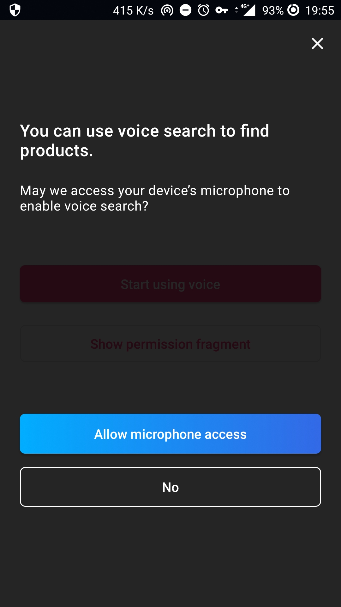
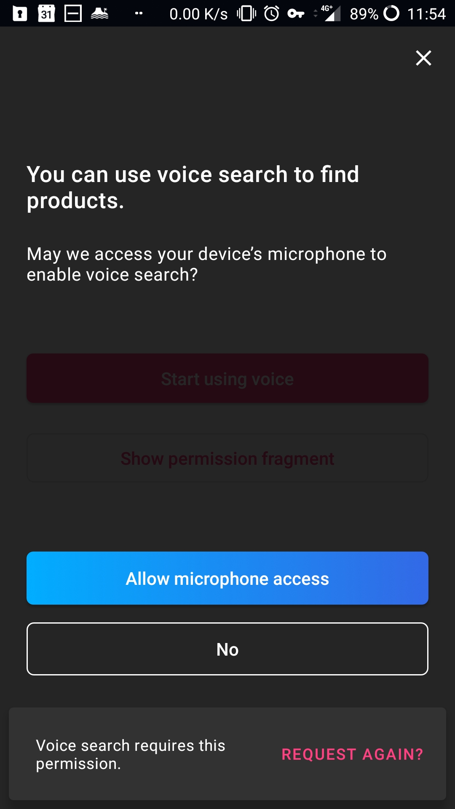

<p align="center">

<a href="./LICENSE"></a>

</p>

# Overview

**Voice overlay** helps you turn your user's **voice** into **text**, providing a **polished UX** while handling for you the **necessary permission**.

<p float="left">
  
  &nbsp;
  
  &nbsp;
  
  &nbsp;
  
  &nbsp;
</p>

# Demo

You can clone this repo, then run the Demo project by doing `./gradlew app:installDebug` and launching the application:


# Installation

The Voice overlay is available as a gradle dependency via [JCenter](https://bintray.com/bintray/jcenter). To install
it, add the following line to your app's `build.gradle`:

```groovy
dependencies {
    // [...]
    implementation 'com.algolia.instantsearch:voice:1.0.0-beta02'
    // [...]
}
```


# Usage

## Basic usage
1. In your Activity, check if you have the permission and show the appropriate `Dialog`:
```kotlin
if (!isRecordAudioPermissionGranted()) {
    VoicePermissionDialogFragment().show(supportFragmentManager, "DIALOG_PERMISSION")
} else {
    VoiceInputDialogFragment().show(supportFragmentManager, "DIALOG_INPUT")
}
```
_See [it implemented in the demo app](app/src/main/kotlin/com/algolia/instantsearch/voice/demo/MainActivity.kt#L26-L30)._

This will display the permission dialog if the `RECORD_AUDIO` permission was not yet granted, then the voice input dialog once the permission is granted.

Once the user speaks, you will get their input back by implementing `VoiceSpeechRecognizer.ResultsListener`:
```kotlin
override fun onResults(possibleTexts: Array<out String>) {
    // Do something with the results, for example:
    resultView.text = possibleTexts.firstOrNull()?.capitalize()
}
```
_See [it implemented in the demo app](app/src/main/kotlin/com/algolia/instantsearch/voice/demo/MainActivity.kt#L41-L43)._

## When the permission is not granted

If the user didn't accept the permission, you [should explain](https://developer.android.com/training/permissions/requesting#explain) the permission's rationale. If they deny the permission, you need to guide them into manually enabling it if they want to use the voice-input feature. 

Voice overlay makes it easy to handle all these cases:

```groovy
override fun onRequestPermissionsResult(requestCode: Int, permissions: Array<out String>, grantResults: IntArray) {
    super.onRequestPermissionsResult(requestCode, permissions, grantResults)
    if (Voice.isRecordPermissionWithResults(requestCode, grantResults)) {
        when {
            Voice.isPermissionGranted(grantResults) -> showVoiceDialog()
                shouldExplainPermission() -> showPermissionRationale(getPermissionView())
                else -> Voice.showPermissionManualInstructions(getPermissionView())
        }
    }
    // [...] eventual handling of other permissions requested by your app 
}
```
_See [it implemented in the demo app](app/src/main/kotlin/com/algolia/instantsearch/voice/demo/MainActivity.kt#L42-L51)._

This will display the permission rationale when the user doesn't allow it, and the manual instructions in case they denied it.

## Customization
You can customize your voice overlay in the following ways:

### Behavior
Several options let you adapt the voice overlay\'s behavior to your needs.

#### Suggestions
You can provide suggestions of what the user could say, to give them some examples. 
```kotlin
voiceInputDialogFragment.setSuggestions(
    "64GB Smartphone",
    "Red running shoes",
    "Cheap TV screen"
)
```

#### AutoStart
You can prevent the overlay from automatically listening to user input.
```kotlin
/// Requires the user to click the mic to start listening. 
voiceInputDialogFragment.autoStart = false
// [...]
// you can also start listening programmatically with
voiceInputDialogFragment.start()
```


### Copy text

You can change any text displayed in the overlay by overriding its resource in your `strings.xml`:
```xml
<!-- VoiceInputDialogFragment -->
<string name="input_title_listening">Listening…</string>
<string name="input_subtitle_listening">Say something like:</string>
<string name="input_title_error">Sorry, we didn\'t quite get that.</string>
<string name="input_subtitle_error">Try repeating your request.</string>
<string name="input_hint_error">Try again</string>

<!-- VoicePermissionDialogFragment -->
<string name="permission_title">You can use voice search to find products.</string>
<string name="permission_subtitle">May we access your device’s microphone to enable voice search?</string>
<string name="permission_button_allow">Allow microphone access</string>
<string name="permission_button_reject">No</string>

<!-- Rationale/Try Again -->
<string name="permission_rationale">Voice search requires this permission.</string>
<string name="permission_button_again">Request again?</string>

<!-- Manual Instructions -->
<string name="permission_enable_rationale">Permission denied, allow it to use voice search.</string>
<string name="permission_button_enable">Allow recording</string>
<string name="permission_enable_instructions">On the next screen, tap Permissions then Microphone.</string>
```
### Layouts

You can replace the voice overlay's layouts by your own, as long as they respect the following structure:

#### Permission

Create a layout called `voice_input.xml` with
- A `ViewGroup` container with id `@+id/voicePermission`
- A `View` with id `@+id/close` for closing the overlay when clicked
- A `TextView` with id `@+id/title`
- A `TextView` with id `@+id/subtitle`

#### Input

Create a layout called `voice_permission.xml` with
- A `ViewGroup` container with id `@+id/voiceInput`
- A `VoiceMicrophone` with id `@+id/microphone` to handle the voice input
- A `TextView` with id `@+id/suggestions` to display eventual suggestions
- A `View` with id `@+id/close` for closing the overlay when clicked
- A `TextView` with id `@+id/title`
- A `TextView` with id `@+id/subtitle`
- An eventual `TextView` with id `@+id/hint` to display a hint on error
- An eventual `RippleView` with id `@+id/ripple` if you want to keep the animation

## Getting Help

- **Need help**? Ask a question to the [Algolia Community](https://discourse.algolia.com/) or on [Stack Overflow](http://stackoverflow.com/questions/tagged/algolia).
- **Found a bug?** You can open a [GitHub issue](https://github.com/algolia/voice-overlay-android/issues/new).
- **Questions about Algolia?** You can search our [FAQ in our website](https://www.algolia.com/doc/faq/).


## Getting involved

* If you **want to contribute** please feel free to [**submit pull requests**](https://github.com/algolia/voice-overlay-android/pull/new).
* If you **have a feature request** please [**open an issue**](https://github.com/algolia/voice-overlay-android/issues/new).
* If you use the **Voice Overlay** in your app, we would love to hear about it! Drop us a line on [discourse](https://discourse.algolia.com/) or [twitter](https://twitter.com/algolia).

## License

The VoiceOverlay is available under the MIT license. See the [LICENSE file](./LICENSE) for more info.
